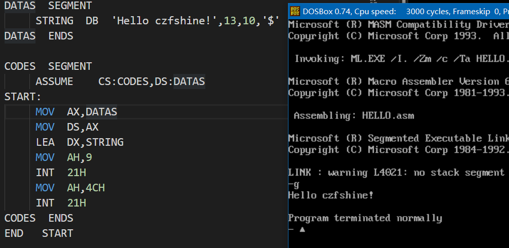

# Assembly-env
基于DosBox与Masm的8086汇编环境，可在64位系统下运行。

>  目前国内高校的汇编语言教学主要以8086cpu为主，其相应的汇编器（masm）和调试器（Debug）在64位的window下无法直接运行，使用DosBox虚拟一个Dos环境进行编程，然而，在该环境下进行编程较痛苦，所以搭建了一个汇编语言的编写环境，可在主机使用VScode或Sublime 等编辑器进行代码编写，然后自动调用DosBox进行汇编与运行。

效果
---

使用编辑器（例如VScode）在任意位置打开汇编文件，按对应的构建快捷键将自动调用DosBox对该文件进行汇编，连接，并用Debug载入编译后的程序。

> 自动调用Debug工具载入编译后的程序

使用与配置
---

### 需要

* DosBox 和Masm 程序
* 一款能高亮汇编代码的编辑器（例如VScode）
* 耐心

下面以VScode为例：

+ 克隆本仓库到本地
+ 修改`.vscode/tasks.json` 内对应的程序路径
+ 将`.vscode/tasks.json` 移动到你的工作文件夹
+ 打开任意的汇编程序文件
+ 按`ctrl +shift +B `  ，选择`run in DosBox with Debug`
+ 正常的话将会弹出`Debug` 程序框，可对程序进行调试

